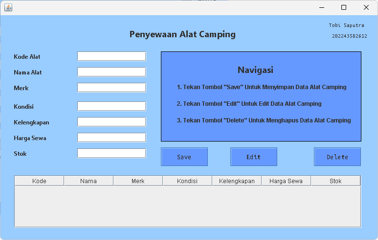

# CARA MENJALANKAN KODE NYA DI NETBEANS

[KLIK DISINI](https://drive.google.com/file/d/1g-bTpQxDjMAYSbeITaNPsriLjMwo1NZ7/view?usp=drive_link) UNTUK MELIHAT SOAL

## Preview GUI

-   Clone / Download Respository Ini
-   Kalau Sudah Pindahkan Folder `uts_tobi` ke Folder `NetBeansProjects` (Biasanya di `C:\Users\Tobi\Documents\NetBeansProjects` atau `C:\Users\Tobi\OneDrive\Documents\NetBeansProjects`)
-   Buka NetBeans
-   Pilih File > Open Project
-   Pilih Folder `uts_tobi` yang sudah dipindahkan ke Folder `NetBeansProjects`
-   Klik `Open Project`
