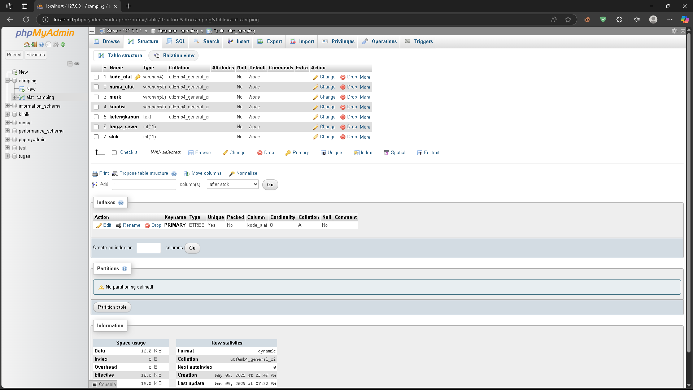

# CARA MENJALANKAN KODE NYA DI NETBEANS

[KLIK DISINI](https://drive.google.com/file/d/1g-bTpQxDjMAYSbeITaNPsriLjMwo1NZ7/view?usp=drive_link) UNTUK MELIHAT SOAL

## Preview GUI


-   Clone / Download Respository Ini
-   Kalau Sudah Pindahkan Folder `uts_tobi` ke Folder `NetBeansProjects` (Biasanya di `C:\Users\Tobi\Documents\NetBeansProjects` atau `C:\Users\Tobi\OneDrive\Documents\NetBeansProjects`)
-   Buka NetBeans
-   Pilih File > Open Project
-   Pilih Folder `uts_tobi` yang sudah dipindahkan ke Folder `NetBeansProjects`
-   Klik `Open Project`

## Setting Database



### Buat Database Auto

-   Buka `XAMPP` dan Jalankan `Apache` dan `MySQL`
-   Buka `phpMyAdmin` di Browser (biasanya di `http://localhost/phpmyadmin`)
-   Klik `Import` di phpMyAdmin
-   Pilih File `camping.sql` yang ada di Folder

## Buat Database Manual

-   Buka `XAMPP` dan Jalankan `Apache` dan `MySQL`
-   Buka `phpMyAdmin` di Browser (biasanya di `http://localhost/phpmyadmin`)
-   Klik `New`
-   Buat Database dengan nama `camping`
-   Klik `SQL` dan Copy Paste Query di bawah ini

```sql
CREATE TABLE `camping` (
  `kode_alat` varchar(4) NOT NULL,
  `nama_alat` varchar(50) NOT NULL,
  `merk` varchar(50) NOT NULL,
  `kondisi` varchar(50) NOT NULL,
  `kelengkapan` TEXT NOT NULL,
  `harga_sewa` INT NOT NULL,
  `stok` INT NOT NULL,
  PRIMARY KEY (`kode_alat`),
) ENGINE=InnoDB DEFAULT CHARSET=utf8mb4;
```
